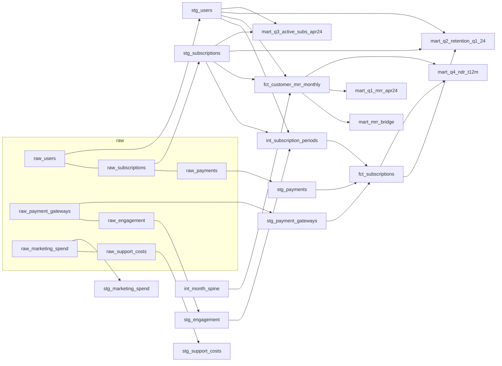

# sql/ — dbt-style DuckDB pipeline (WP01 + WP30)

## How to run

```bash
export PYTHONIOENCODING=utf-8
./.venv/Scripts/python.exe sql/run_pipeline.py
```

This is idempotent: it deletes `db/platzi.duckdb` if present and rebuilds it
from scratch every run, in one command. It prints PASS/FAIL for every file in
`sql/tests/`, and exports every `fct_*` / `mart_*` table to
`outputs/marts/<name>.csv`.

To explore the warehouse interactively:

```bash
./.venv/Scripts/python.exe -c "import duckdb; con = duckdb.connect('db/platzi.duckdb'); print(con.sql('SELECT * FROM mart_q1_mrr_apr24'))"
```

## Layers (dbt convention)

```
raw_*            <- read_csv_auto() straight off Docs/Originals/*.csv (7 tables)
  |
  v
staging/stg_*    <- 1:1 with raw tables. Casts types (DATE, DOUBLE, INTEGER),
  |                 trims strings, lower-cases emails, derives
  |                 users.customer_type ('B2C' vs 'B2B' = SMB+Enterprise),
  |                 and turns marketing_spend.month / support_costs.month
  |                 ("YYYY-MM" strings) into DATE (first of month).
  v
intermediate/
  int_month_spine            <- 16 month-end/month-start rows, 2023-01-31..2024-04-30
  int_subscription_periods   <- one row per subscription, joined to stg_users (segment,
                                 customer_type) and stg_engagement, with window
                                 functions for period_number, prev_mrr, next_mrr,
                                 mrr_delta, renewal_change, tenure_months, period_days
  v
marts/
  fct_subscriptions          <- int_subscription_periods + payment rollups
                                 (n_payments, amount_paid, main_gateway) per subscription
  fct_customer_mrr_monthly   <- user x month-end grid (from signup month to 2024-04-30)
                                 with mrr (M-02), prev_mrr, movement
  mart_mrr_bridge            <- fct_customer_mrr_monthly aggregated to month x segment
                                 (+ B2B, + Total): opening/new/expansion/contraction/
                                 churn/closing MRR, active customers
  mart_q1_mrr_apr24          <- Q1: MRR at 2024-04-30 by segment (+B2B, +Total), % mix
  mart_q2_retention_q1_24    <- Q2: M-06 primary (renewal-event, logo & $) +
                                 M-07 cross-check (customer snapshot), incl. monthly/annual split
  mart_q3_active_subs_apr24  <- Q3: active subs at 2024-04-30 by segment x plan_type + totals
  mart_q4_ndr_t12m           <- Q4: M-08 NDR, M-09 GRR, M-10 bridge, + renewal-event cross-check
  v
tests/           <- sql/tests/*.sql, each must return 0 rows to PASS (row counts,
                     unique keys, referential integrity, bridge identity, Q1=fct
                     cross-check, Q3 sums to 1,941, NDR identity / GRR<=1 / NDR>=GRR)
  |
  v
python_models/   <- sql/python_models/*.py (WP31 bonus). run_pipeline.py imports
                     every file here that exposes build(con), sorted by filename,
                     AFTER the SQL marts above and BEFORE sql/tests/ runs. Needed
                     because the scenario engine is an iterative monthly
                     simulation (12 compartments x 12 months x 3 scenarios x 3
                     strategies x 3 cases), which isn't expressible as a single
                     SELECT. Currently one file: scenarios.py, writing
                     mart_s_01_drivers .. mart_s_06_backtest_summary (WP31
                     scenario model + WP23 strategy sizing) -- see
                     work/WP31_scenarios/results.md and
                     work/WP23_strategies/results.md.
```

Mermaid lineage diagram:



## Design notes / implementation decisions (not M-xx metrics, documented here)

- **`next_status`** in `int_subscription_periods` / `fct_subscriptions` is a
  pass-through of `subscriptions.status`: the status field already encodes what
  happens at `end_date` (renewed = a next period exists, active = still open at
  the data snapshot, churned = chain ends). It is aliased/duplicated as
  `next_status` for self-documentation in downstream marts.
- **`main_gateway`** (in `fct_subscriptions`) = the payment gateway used on the
  largest number of payments for that subscription_id; ties broken by the
  lowest `payment_gateway_id`.
- **`movement`** categories in `fct_customer_mrr_monthly` (`new`, `expansion`,
  `contraction`, `churn`, `retained_flat`, `inactive`) extend the M-10
  vocabulary to a full monthly grid (M-10 itself only defines expansion /
  contraction / churn for a fixed start/end pair). `retained_flat` = no MRR
  change while active; `inactive` = no coverage before signup / after churn.
- Q1/Q2/Q3/Q4 marts add `B2B` (= SMB + Enterprise) and `Total` roll-up rows
  alongside the native `segment` values, using `UNION ALL` expansions — this
  keeps one flat table per question instead of several near-duplicate tables.

## DuckDB-specific functions (isolate before a BigQuery port, WP34)

| Used here | DuckDB | BigQuery equivalent |
|---|---|---|
| `int_month_spine.sql` | `generate_series(DATE, DATE, INTERVAL 1 MONTH)` | `GENERATE_DATE_ARRAY(start, end, INTERVAL 1 MONTH)` (returns an ARRAY; needs `UNNEST`) |
| `int_month_spine.sql` | `date_trunc('month', d)` | `DATE_TRUNC(d, MONTH)` (args reversed) |
| `int_subscription_periods.sql` | `DATE_DIFF('day', start_date, end_date)` | `DATE_DIFF(end_date, start_date, DAY)` (dates first, unit last — reversed argument order and no bare `date - date` subtraction) |
| `run_pipeline.py` (loader) | `read_csv_auto('...')` | `bq load` / `LOAD DATA` from GCS, or an external table |
| everywhere | `CREATE OR REPLACE TABLE x AS <select>` | same syntax works in BigQuery; only the two functions above need editing |

Everything else (window functions `ROW_NUMBER`/`LAG`/`LEAD`, `CASE`, standard
joins, `CAST`, string `TRIM`/`LOWER`/`||`) is ANSI-portable and should run
unmodified in BigQuery Standard SQL.

## BigQuery port (WP34b) — proving the model runs natively in BigQuery

`sql/bigquery/` contains a from-scratch BigQuery Standard SQL port of the four
challenge answers (Q1–Q4), written to run **from the raw tables only**
(`raw_users`, `raw_subscriptions` — never `mart_*`/`fct_*`), so it proves the
SQL logic itself runs natively in BigQuery rather than just proving the CSVs
loaded. This is separate from `load_to_bigquery.ps1`, which only loads the
already-computed DuckDB CSVs (marts) as a convenience for BI tools (Looker
Studio).

**Files**

| File | Purpose |
|---|---|
| `sql/bigquery/q1_mrr_apr24.sql` | Q1 MRR at 2024-04-30 by segment → `CREATE OR REPLACE TABLE platzi_fpa.bq_q1_mrr_apr24` |
| `sql/bigquery/q2_retention_q1_24.sql` | Q2 Q1-24 retention (logo & $, M-06 + M-07) → `bq_q2_retention_q1_24` |
| `sql/bigquery/q3_active_subs_apr24.sql` | Q3 active subs at 2024-04-30 by segment × plan → `bq_q3_active_subs_apr24` |
| `sql/bigquery/q4_ndr_t12m.sql` | Q4 NDR T12M (M-08/M-09/M-10) → `bq_q4_ndr_t12m` |
| `sql/bigquery/reconcile.py` | Pulls each `bq_*` table + the matching DuckDB `outputs/marts/mart_q*.csv`, diffs row by row, prints PASS/FAIL, writes `outputs/bigquery_reconciliation.csv` |
| `sql/bigquery/run_bigquery.ps1` | Runs the 4 `.sql` files then `reconcile.py`, in order |
| `sql/bigquery/load_to_bigquery.ps1` | (pre-existing) loads raw CSVs + DuckDB mart CSVs as BigQuery tables |

**How to run**

```powershell
powershell -ExecutionPolicy Bypass -File sql\bigquery\run_bigquery.ps1
```

(Each `.sql` file is also runnable stand-alone: `bq.cmd --project_id=... query
--use_legacy_sql=false < sql\bigquery\q1_mrr_apr24.sql`, with
`$LOCALAPPDATA\gcloud\google-cloud-sdk\bin` on PATH.)

Result (2026-09-27): **242/242 reconciliation rows PASS** (tolerance: money
0.01, rates 0.0001, counts exact). Headline figures match exactly: Q1 total
MRR 204,709.09; Q2 logo retention 90.1% (Total, M06 all); Q3 1,941 active
subs; Q4 NDR T12M 63.7% / GRR 59.9% / base 417 customers.

**Dialect differences (BigQuery Standard SQL vs. DuckDB)**

| Concern | DuckDB | BigQuery | Where it shows up |
|---|---|---|---|
| Date generation | `generate_series(DATE, DATE, INTERVAL 1 MONTH)` | `GENERATE_DATE_ARRAY(start, end, INTERVAL 1 MONTH)` (returns an `ARRAY`, needs `UNNEST`) | Not needed in the BQ port — Q1/Q4 only need MRR at fixed snapshot dates, not a full monthly grid, so the date spine (`int_month_spine`) is skipped entirely |
| Month truncation | `date_trunc('month', d)` | `DATE_TRUNC(d, MONTH)` (argument order reversed) | Same reason — not used in the BQ port |
| Date difference | `DATE_DIFF('day', start_date, end_date)` (unit first) | `DATE_DIFF(end_date, start_date, DAY)` (dates first, unit last) | Not needed — `period_days`/`tenure_months` aren't required by Q1–Q4, so this function isn't ported |
| Table replace | `CREATE OR REPLACE TABLE x AS <select>` | Same syntax | Used identically in both |
| Window functions | `ROW_NUMBER()`, `LAG()`, `LEAD()` OVER (...) | Identical | Used identically (Q2 `next_mrr`, Q4 renewal cross-check `period_number`/`mrr_delta`) |
| String cleanup | `trim(...)`, `lower(...)`, `\|\|` | `TRIM(...)`, `LOWER(...)`, `\|\|` | Identical (BigQuery is case-insensitive on function names) |
| Casts | `CAST(x AS DOUBLE)` / `CAST(x AS BIGINT)` | `CAST(x AS FLOAT64)` / `CAST(x AS INT64)` | Type names differ; used defensively even though `bq load --autodetect` already typed `raw_subscriptions.mrr` as FLOAT and the date columns as DATE |
| `LEAST()` | Built-in | Built-in, identical | Used unchanged in Q4 GRR calc |
| stdin encoding | n/a | `bq query` rejects a UTF-8 BOM on stdin as `Illegal input character "\357"` | `run_bigquery.ps1` rewrites each `.sql` to a temp file with explicit BOM-less UTF-8 before redirecting it into `bq.cmd` |

Two staging tables used by the DuckDB pipeline (`stg_payments`,
`stg_payment_gateways`, `stg_engagement`) are **not** needed by Q1–Q4 (they
only feed `fct_subscriptions`'s payment/gateway columns and engagement
features, which none of the four questions select), so the BigQuery port
recomputes only `stg_users` + `stg_subscriptions` inline as CTEs, plus the
subset of `int_subscription_periods` / `fct_customer_mrr_monthly` logic each
question actually reads — kept self-contained per file rather than layered
staging→intermediate→marts, since BigQuery Sandbox has no views/DML budget to
spare on intermediate materializations.

## Row counts (post-staging, verified by `test_row_counts.sql`)

users 2,695 · subscriptions 9,683 · payments 17,209 · engagement 9,683 ·
marketing_spend 144 · support_costs 64.
